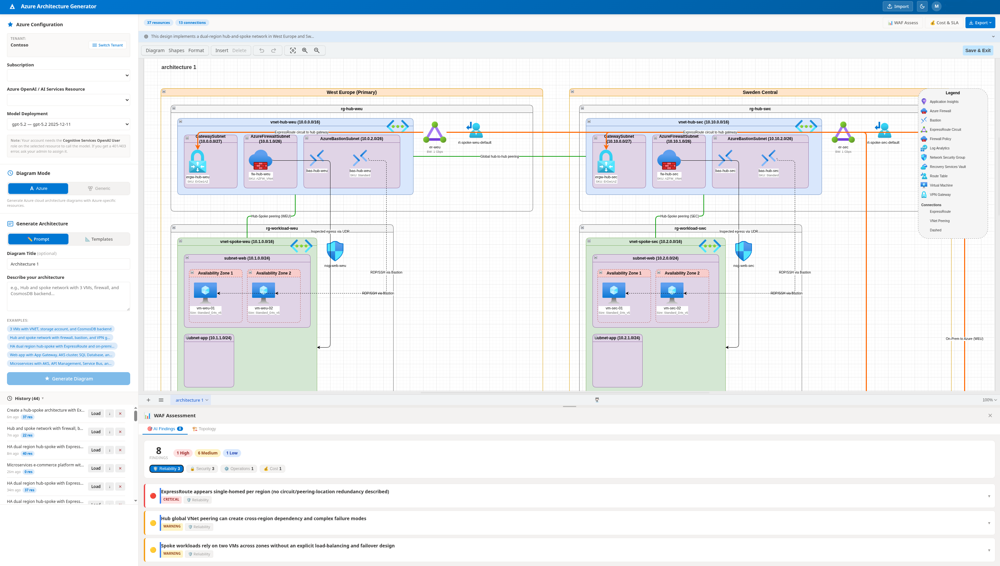

# AI Architecture Generator for Azure

**Describe your Azure architecture in plain English — get a professional Draw.io diagram in seconds.**

No Visio. No manual dragging. Just tell the AI what you need, and it builds a pixel-perfect architecture diagram with official Azure icons, proper network topology, and resource hierarchy.

---

## What It Does

```
"Create a hub-spoke architecture with ExpressRoute
 in West Europe and Sweden Central Azure regions,
 2 VMs in each, Azure Firewall and Bastion"
```

**↓ Generates this ↓**



A fully structured Draw.io diagram with:
- Nested subscriptions, regions, resource groups, VNets, and subnets
- Official Azure icon stencils for every resource
- Network connections (peering, ExpressRoute, VPN) with proper styling
- Automatic hub-to-hub global VNet peering for multi-region
- Automatic Bastion host placement in hub VNets

---

## Quick Start

### Prerequisites

| Requirement | Why |
|---|---|
| **Node.js 18+** | Runtime |
| **Azure CLI** | Authentication (`az login`) |
| **Azure OpenAI** | GPT model access (gpt-5 series) |

### 1. Clone & Install

```bash
git clone https://github.com/MikaVirkkunen/AI-architecture-generator.git
cd AI-architecture-generator
npm install
cd web && npm install && cd ..
```

### 2. Login to Azure

```bash
az login
```

### 3. Run

```bash
# Start both backend + frontend
npm run dev:full
```

Open **http://localhost:5173** in your browser.

---

## How to Use

### Step 1 — Select Your AI Model

The app auto-discovers your Azure OpenAI resources and deployments. Pick a subscription, resource, and GPT model from the dropdowns.

### Step 2 — Describe Your Architecture

Type a natural language description of what you want. Examples:

| Prompt | What You Get |
|---|---|
| `"Simple 3-tier web app in West Europe"` | VNet with web, app, and data subnets + VMs, App Service, SQL |
| `"Hub-spoke with ExpressRoute and VPN"` | Hub VNet with firewall, gateway, bastion + spoke VNets + on-premises |
| `"HA dual-region with Azure Front Door"` | Two regions with failover, global load balancing |
| `"AKS with Cosmos DB and private endpoints"` | Kubernetes cluster with private PaaS connectivity |
| `"Multi-subscription with Fabric and Databricks"` | Separate subscriptions for landing zone and data platform |

### Step 3 — Generate & Export

Click **Generate** → preview the diagram live → click **Export .drawio** to download and open in [draw.io](https://app.diagrams.net) or VS Code.

---

## Architecture Patterns

The AI understands these patterns automatically:

| Pattern | Trigger Words |
|---|---|
| **Hub & Spoke** | "hub-spoke", "hub and spoke" |
| **High Availability** | "HA", "high availability", "dual region" |
| **ExpressRoute** | "ExpressRoute", "on-premises connectivity" |
| **Private Endpoints** | "private endpoint", "private connectivity" |
| **Availability Zones** | "zone redundant", "availability zones" |
| **Multi-Subscription** | "separate subscription", "dedicated subscription" |

---

## Supported Azure Services (128 types)

<details>
<summary><strong>Networking (34 services)</strong></summary>

Virtual Network, Hub VNet, Subnet, NSG, ASG, Load Balancer, Application Gateway, WAF Policy, Front Door, Traffic Manager, CDN, Azure Firewall, Firewall Policy, Bastion, DDoS Protection, VPN Gateway, ExpressRoute, ExpressRoute Direct, Virtual WAN, Virtual Hub, Private Endpoint, Private Link, Public IP, Public IP Prefix, NAT Gateway, Route Table, Route Filter, Local Network Gateway, VNet Connection, DNS Zone, Private DNS, Network Watcher, Network Manager, NIC

</details>

<details>
<summary><strong>Compute (15 services)</strong></summary>

Virtual Machine, VM Scale Set, AKS, Container Instance, Container App, Container App Environment, Container Registry, Function App, App Service, App Service Plan, Azure Virtual Desktop, Managed Disk, Service Fabric, Batch, Spring App

</details>

<details>
<summary><strong>Databases (14 services)</strong></summary>

Cosmos DB, SQL Server, SQL Database, SQL Managed Instance, SQL Elastic Pool, SQL VM, MySQL, PostgreSQL, PostgreSQL Flexible, MariaDB, Redis Cache, Data Explorer, Database Migration Service

</details>

<details>
<summary><strong>AI & Machine Learning (11 services)</strong></summary>

Azure OpenAI, Cognitive Services, Machine Learning, Bot Service, AI Search, AI Foundry, Document Intelligence, Speech Service, Computer Vision, Language Service, Content Safety

</details>

<details>
<summary><strong>Analytics (9 services)</strong></summary>

Databricks, Synapse Analytics, Purview, Data Factory, Stream Analytics, HDInsight, Analysis Services, Power BI Embedded, Microsoft Fabric

</details>

<details>
<summary><strong>Security (6 services)</strong></summary>

Key Vault, NSG, WAF, Defender for Cloud, Microsoft Sentinel, Managed Identity

</details>

<details>
<summary><strong>Integration (8 services)</strong></summary>

API Management, Service Bus, Event Hub, Event Grid, Logic App, App Configuration, Integration Account, Relay

</details>

<details>
<summary><strong>Monitoring (5 services)</strong></summary>

Application Insights, Log Analytics, Managed Grafana, Azure Monitor, Action Group

</details>

<details>
<summary><strong>Storage (3 services)</strong></summary>

Storage Account, Data Lake, Azure NetApp Files

</details>

<details>
<summary><strong>IoT (3 services)</strong></summary>

IoT Hub, IoT Central, Digital Twins

</details>

<details>
<summary><strong>Identity (2 services)</strong></summary>

Azure AD / Entra ID, Managed Identity

</details>

<details>
<summary><strong>Web (3 services)</strong></summary>

Static Web App, Notification Hub, Communication Service

</details>

<details>
<summary><strong>Management (7 services)</strong></summary>

Recovery Services Vault, Automation Account, Azure Arc, Backup Center, Azure Policy, Azure Advisor, Azure Migrate

</details>

<details>
<summary><strong>DevOps (1 service)</strong></summary>

Azure DevOps

</details>

---

## Project Structure

```
AI-architecture-generator/
├── src/
│   ├── server.ts              # Express API (port 3001)
│   ├── ai/
│   │   └── parser.ts          # System prompt + AI response parser
│   ├── drawio/
│   │   └── xml-builder.ts     # Draw.io XML generation engine
│   ├── schema/
│   │   ├── resources.ts       # 128 Azure service definitions + icons
│   │   └── types.ts           # TypeScript interfaces
│   └── utils/
│       └── id-generator.ts    # Unique cell ID generator
├── web/                       # React + Vite frontend
│   └── src/
│       ├── App.tsx
│       └── components/
│           ├── ConfigPanel.tsx      # Azure resource discovery
│           ├── GeneratePanel.tsx     # Prompt input + generation
│           ├── DiagramViewer.tsx     # Live Draw.io preview
│           └── Header.tsx
├── templates/                 # Pre-built architecture templates
└── package.json
```

---

## How It Works

```
┌──────────────┐     ┌───────────────┐     ┌──────────────┐     ┌──────────────┐
│  Your Prompt │────▶│  GPT-5 Model  │────▶│  Parser +    │────▶│  Draw.io XML │
│  (plain text)│     │  (Azure OpenAI)│     │  Auto-fixes  │     │  (.drawio)   │
└──────────────┘     └───────────────┘     └──────────────┘     └──────────────┘
```

1. **You describe** the architecture in natural language
2. **GPT generates** a structured JSON with resources, connections, and hierarchy
3. **Parser validates** the response — auto-adds Bastion hosts, hub-to-hub peering, fixes AZ assignments
4. **XML Builder** creates a Draw.io diagram with proper nesting, official Azure icons, and styled connections
5. **DiagramViewer** renders it live in an embedded Draw.io iframe

---

## Tech Stack

| Layer | Technology |
|---|---|
| **Frontend** | React 18 + TypeScript + Vite 5 |
| **Backend** | Node.js + Express + TypeScript |
| **AI** | Azure OpenAI (GPT-5 series) |
| **Diagrams** | Draw.io / diagrams.net (embedded) |
| **XML** | xmlbuilder2 |
| **Auth** | Azure CLI (`az account get-access-token`) |

---

## Available Scripts

```bash
npm run server       # Backend API only (port 3001)
npm run web:dev      # Frontend only (port 5173)
npm run dev:full     # Both (recommended)
npm run build        # Compile TypeScript
npm run cli          # CLI mode (env vars for config)
npm run test         # Run test diagrams
```

---

## CLI Mode

For scripting or CI/CD, you can use the CLI directly:

```bash
export AZURE_OPENAI_ENDPOINT="https://your-resource.openai.azure.com"
export AZURE_OPENAI_KEY="your-key"
export AZURE_OPENAI_DEPLOYMENT="gpt-5"

npm run cli -- --prompt "Hub-spoke with ExpressRoute" --output my-diagram.drawio
```

---

## License

MIT — see [LICENSE](LICENSE)

This project generates Azure architecture diagrams from natural language descriptions, without needing existing Azure resources.

---

## Contributing

1. Fork the repo
2. Create a feature branch (`git checkout -b feature/my-feature`)
3. Commit your changes (`git commit -am 'Add my feature'`)
4. Push to the branch (`git push origin feature/my-feature`)
5. Open a Pull Request
