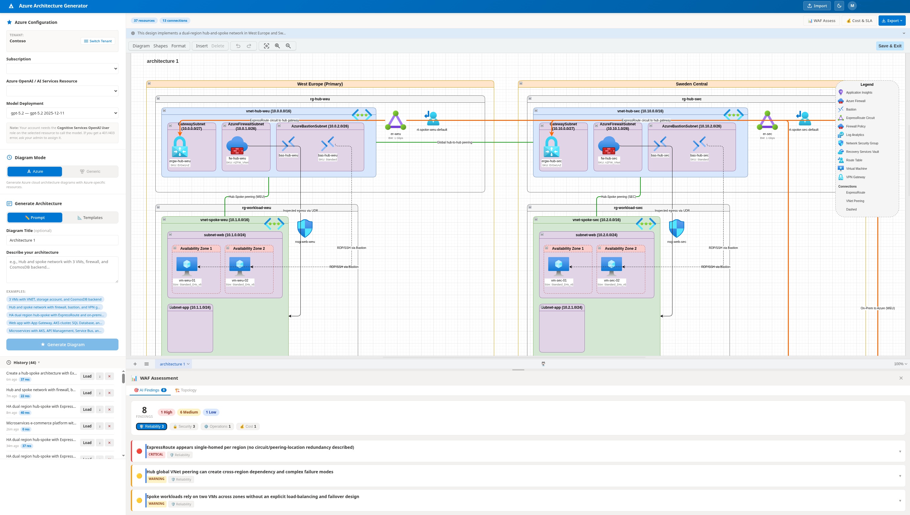

# AI Architecture Generator

**Describe any architecture in plain English — get a professional Draw.io diagram in seconds.**

No Visio. No manual dragging. Just tell the AI what you need, and it builds a structured architecture diagram with proper topology, resource hierarchy, and animated connections. Supports **Azure**, **AWS**, **GCP**, **Kubernetes**, **microservices**, **AI agent flows**, **data pipelines**, and any custom architecture.

> **⚠️ Vibe Coded Project Disclaimer**
> This project was largely built using AI-assisted "vibe coding" with GitHub Copilot. While functional and useful, it has not undergone the same level of review as production software. Use it at your own risk, and always review generated architecture diagrams against official best practices before using them in real-world scenarios. AI-generated diagrams may contain inaccuracies or hallucinations.

---

## What It Does

### Azure Mode
```
"Create a hub-spoke architecture with ExpressRoute
 in West Europe and Sweden Central Azure regions,
 2 VMs in each, Azure Firewall and Bastion"
```

### Generic Mode
```
"Multi-agent research system with orchestrator,
 search agent, analysis agent, and GPT-4 backbone
 with vector database and Redis cache"
```

**↓ Generates this ↓**



A fully structured Draw.io diagram with:
- **Azure Mode:** Nested subscriptions, regions, resource groups, VNets, and subnets with official Azure icon stencils
- **Generic Mode:** Grouped systems, layers, zones, and swimlanes with animated flowing connections
- Network connections with proper styling (peering, ExpressRoute, VPN, animated flows)
- Automatic resource placement and hierarchy inference
- Live preview in an embedded Draw.io viewer

---

## Features

### 🏗️ Multi-Cloud & Generic Architectures
Not just Azure — describe architectures for any technology stack:

| Mode | What You Can Build |
|---|---|
| **Azure** | Hub-spoke networks, HA multi-region, AKS clusters, SAP on Azure, 128+ Azure service types with official icons |
| **Generic** | AI agent flows, microservices, data pipelines, network topologies, CI/CD pipelines, and any custom architecture |

### 🔍 WAF Assessment
Evaluate Azure architectures against the **Well-Architected Framework** with AI-powered analysis:
- Checklist-based assessment using [Microsoft Azure Review Checklists](https://github.com/Azure/review-checklists)
- Findings across 5 WAF pillars: Cost, Reliability, Security, Performance, and Operational Excellence
- Topology rule analysis (subnet sizing, NSG placement, peering validation)
- Severity-rated findings with specific remediation guidance

### 💰 Cost & SLA Estimation
AI-powered cost and availability analysis for Azure architectures:
- Monthly PAYG cost estimates per resource with SKU recommendations
- Composite SLA calculations across critical user flow paths
- Cost optimization recommendations (reserved instances, right-sizing, tier changes)
- Streamed output for real-time progress

### 📦 Infrastructure as Code Export *(experimental)*
Generate IaC templates as a starting point for your deployments:
- **Bicep** — Azure Verified Modules (AVM), modular structure with `main.bicep` + per-module files + parameter files per environment
- **Terraform** — AVM-based HCL with modular layout, `variables.tf`, `outputs.tf`, backend config, and environment-specific `.tfvars`

> **Note:** Generated IaC is a scaffold, not production-ready code. Always review and test before deploying.

### 🎬 Animated Connections
Generic diagrams support animated flowing connections in Draw.io:
- Flow, pulse, marching, and glow animation styles
- Semantic color coding for connection types (data flow, control, async, errors)
- Per-connection or global animation configuration

### 📤 Multiple Export Formats
| Format | Extension | Description |
|---|---|---|
| Draw.io | `.drawio` | Native Draw.io XML, editable in [draw.io](https://app.diagrams.net) or VS Code |
| PNG | `.png` | Raster image with configurable scale (1x–4x) and background |
| SVG | `.svg` | Vector image |
| PDF | `.pdf` | Print-quality export (A3) |
| Editable PNG | `.png` | PNG with embedded Draw.io diagram (re-editable) |
| Bicep | `.bicep` | Azure IaC templates (AVM-based) |
| Terraform | `.tf` | HCL IaC templates (AVM-based) |

### 📐 Template Library
Pre-built Azure architecture templates to start from — load a template, customize it with natural language, and generate.

### 🔄 Iterative Refinement
Refine diagrams through conversation. After generating, describe changes and the AI modifies the existing architecture without starting from scratch.

### 📥 Import & Analyze
Import existing `.drawio` files, analyze their structure, and refine them with AI.

---

## Quick Start

### Prerequisites

| Requirement | Why |
|---|---|
| **Node.js 18+** | Runtime |
| **Azure CLI** | Authentication (`az login`) |
| **Azure OpenAI** | GPT model access |

### 1. Clone & Install

```bash
git clone https://github.com/MikaVirkkunen/AI-architecture-generator.git
cd AI-architecture-generator
npm install
cd web && npm install && cd ..
```

### 2. Login to Azure

```bash
az login
```

### 3. Run

```bash
# Start both backend + frontend
npm run dev:full
```

Open **http://localhost:5173** in your browser.

---

## How to Use

### Step 1 — Select Your AI Model

The app auto-discovers your Azure OpenAI resources and deployments. Pick a subscription, resource, and GPT model from the dropdowns.

### Step 2 — Choose Diagram Mode

Toggle between **Azure** and **Generic** mode:
- **Azure** — Cloud architecture diagrams with 128+ Azure service types, official icons, VNet hierarchy, and region support
- **Generic** — Technology-agnostic diagrams for any architecture: AI agents, microservices, data pipelines, network topologies, and more

### Step 3 — Describe Your Architecture

Type a natural language description. Examples:

| Prompt | Mode | What You Get |
|---|---|---|
| `"Hub-spoke with ExpressRoute and VPN"` | Azure | Hub VNet with firewall, gateway, bastion + spoke VNets + on-premises |
| `"HA dual-region with Azure Front Door"` | Azure | Two regions with failover, global load balancing |
| `"AKS with Cosmos DB and private endpoints"` | Azure | Kubernetes cluster with private PaaS connectivity |
| `"Multi-agent research system with orchestrator, search and analysis agents"` | Generic | AI agent flow with orchestrator, sub-agents, LLM backbone |
| `"Microservices e-commerce with API gateway, Kafka, and per-service databases"` | Generic | Service mesh with gateway, message broker, data stores |
| `"Real-time data pipeline with Kafka, Flink, and ClickHouse"` | Generic | Streaming pipeline with ingestion, processing, and warehouse |

### Step 4 — Generate, Assess & Export

1. Click **Generate** → preview the diagram live
2. Click **🔍 Assess** → run a WAF assessment (Azure mode)
3. Click **💰 Cost & SLA** → estimate monthly costs and composite SLA (Azure mode)
4. Click **Export** → download as .drawio, .png, .svg, .pdf, Bicep, or Terraform

---

## Architecture Patterns

### Azure Mode

The AI understands these patterns automatically:

| Pattern | Trigger Words |
|---|---|
| **Hub & Spoke** | "hub-spoke", "hub and spoke" |
| **High Availability** | "HA", "high availability", "dual region" |
| **ExpressRoute** | "ExpressRoute", "on-premises connectivity" |
| **Private Endpoints** | "private endpoint", "private connectivity" |
| **Availability Zones** | "zone redundant", "availability zones" |
| **Multi-Subscription** | "separate subscription", "dedicated subscription" |
| **SAP on Azure** | "SAP", "SAP HANA", "S/4HANA" |

### Generic Mode

| Pattern | Trigger Words |
|---|---|
| **AI Agent Flow** | "agent", "orchestrator", "multi-agent", "LLM" |
| **Microservices** | "microservices", "service mesh", "API gateway" |
| **Data Pipeline** | "pipeline", "ETL", "streaming", "Kafka" |
| **Network Topology** | "network", "firewall", "load balancer" |

---

## Supported Azure Services (128+ types)

<details>
<summary><strong>Networking (34 services)</strong></summary>

Virtual Network, Hub VNet, Subnet, NSG, ASG, Load Balancer, Application Gateway, WAF Policy, Front Door, Traffic Manager, CDN, Azure Firewall, Firewall Policy, Bastion, DDoS Protection, VPN Gateway, ExpressRoute, ExpressRoute Direct, Virtual WAN, Virtual Hub, Private Endpoint, Private Link, Public IP, Public IP Prefix, NAT Gateway, Route Table, Route Filter, Local Network Gateway, VNet Connection, DNS Zone, Private DNS, Network Watcher, Network Manager, NIC

</details>

<details>
<summary><strong>Compute (15 services)</strong></summary>

Virtual Machine, VM Scale Set, AKS, Container Instance, Container App, Container App Environment, Container Registry, Function App, App Service, App Service Plan, Azure Virtual Desktop, Managed Disk, Service Fabric, Batch, Spring App

</details>

<details>
<summary><strong>Databases (14 services)</strong></summary>

Cosmos DB, SQL Server, SQL Database, SQL Managed Instance, SQL Elastic Pool, SQL VM, MySQL, PostgreSQL, PostgreSQL Flexible, MariaDB, Redis Cache, Data Explorer, Database Migration Service

</details>

<details>
<summary><strong>AI & Machine Learning (11 services)</strong></summary>

Azure OpenAI, Cognitive Services, Machine Learning, Bot Service, AI Search, AI Foundry, Document Intelligence, Speech Service, Computer Vision, Language Service, Content Safety

</details>

<details>
<summary><strong>Analytics (9 services)</strong></summary>

Databricks, Synapse Analytics, Purview, Data Factory, Stream Analytics, HDInsight, Analysis Services, Power BI Embedded, Microsoft Fabric

</details>

<details>
<summary><strong>Security (6 services)</strong></summary>

Key Vault, NSG, WAF, Defender for Cloud, Microsoft Sentinel, Managed Identity

</details>

<details>
<summary><strong>Integration (9 services)</strong></summary>

API Management, Service Bus, Event Hub, Event Grid, Logic App, App Configuration, Integration Account, Relay, SignalR

</details>

<details>
<summary><strong>Monitoring (5 services)</strong></summary>

Application Insights, Log Analytics, Managed Grafana, Azure Monitor, Action Group

</details>

<details>
<summary><strong>Storage (4 services)</strong></summary>

Storage Account, Data Lake, Azure NetApp Files, Elastic SAN

</details>

<details>
<summary><strong>SAP (6 services)</strong></summary>

SAP HANA, SAP NetWeaver, SAP App, SAP Router, SAP Web Dispatcher, HANA Large Instance

</details>

<details>
<summary><strong>IoT (3 services)</strong></summary>

IoT Hub, IoT Central, Digital Twins

</details>

<details>
<summary><strong>Identity (2 services)</strong></summary>

Azure AD / Entra ID, Managed Identity

</details>

<details>
<summary><strong>Web (3 services)</strong></summary>

Static Web App, Notification Hub, Communication Service

</details>

<details>
<summary><strong>Management (7 services)</strong></summary>

Recovery Services Vault, Automation Account, Azure Arc, Backup Center, Azure Policy, Azure Advisor, Azure Migrate

</details>

<details>
<summary><strong>DevOps (1 service)</strong></summary>

Azure DevOps

</details>

### Generic Node Types

<details>
<summary><strong>All generic node types</strong></summary>

**User/Actor:** user, userGroup
**AI/Agent:** agent, orchestrator, subAgent, llm
**API/Web:** api, webApp, mobileApp
**Compute:** server, container, microservice, workflow
**Data:** database, queue, cache, storage
**Networking:** gateway, loadBalancer, firewall
**Monitoring:** monitor, notification, email, chat
**Documents:** document
**External:** cloud, thirdParty, custom

</details>

---

## Project Structure

```
AI-architecture-generator/
├── src/
│   ├── server.ts              # Express API (port 3001)
│   ├── ai/
│   │   ├── parser.ts          # System prompts + AI response parsers
│   │   └── providers/         # AI provider adapters
│   ├── drawio/
│   │   ├── xml-builder.ts     # Azure Draw.io XML generation
│   │   ├── generic-builder.ts # Generic Draw.io XML generation
│   │   └── animation-styles.ts # Connection animation definitions
│   ├── schema/
│   │   ├── resources.ts       # 128+ Azure service definitions + icons
│   │   ├── generic-types.ts   # Generic architecture type definitions
│   │   ├── generic-resources.ts # Generic node type definitions
│   │   └── types.ts           # Core TypeScript interfaces
│   ├── assessment/
│   │   ├── assessor.ts        # WAF assessment engine
│   │   ├── cost-estimator.ts  # AI cost & SLA estimation
│   │   ├── checklist-mapper.ts # Azure Review Checklist mapping
│   │   └── topology-rules.ts  # Topology validation rules
│   ├── iac/
│   │   ├── bicep/
│   │   │   ├── bicep-generator.ts  # Bicep template generation (AVM)
│   │   │   ├── avm-registry.ts     # AVM Bicep module registry
│   │   │   └── param-generator.ts  # Bicep parameter file generation
│   │   ├── terraform/
│   │   │   ├── tf-generator.ts     # Terraform HCL generation (AVM)
│   │   │   └── avm-registry.ts     # AVM Terraform module registry
│   │   ├── resource-mapper.ts # Architecture → IaC resource mapping
│   │   └── types.ts           # IaC type definitions
│   ├── validation/            # Architecture validation rules
│   ├── import/                # .drawio file import & analysis
│   ├── templates/             # Pre-built architecture templates
│   └── utils/
│       └── id-generator.ts
├── web/                       # React + Vite frontend
│   └── src/
│       ├── App.tsx            # Main app (Diagram, Assessment, Cost tabs)
│       └── components/
│           ├── ConfigPanel.tsx      # Azure resource discovery
│           ├── GeneratePanel.tsx    # Prompt input + template selection
│           ├── DiagramViewer.tsx    # Live Draw.io preview
│           ├── ExportDropdown.tsx   # Multi-format export menu
│           ├── AssessmentPanel.tsx  # WAF assessment results
│           ├── CostSlaPanel.tsx     # Cost & SLA estimation results
│           ├── IaCExportModal.tsx   # Bicep/Terraform export modal
│           ├── TemplateGrid.tsx     # Template library browser
│           ├── HistoryPanel.tsx     # Generation history
│           ├── ImportModal.tsx      # .drawio file import
│           └── Header.tsx
└── package.json
```

---

## How It Works

```
┌──────────────┐     ┌───────────────┐     ┌──────────────┐     ┌──────────────┐
│  Your Prompt │────▶│  GPT Model    │────▶│  Parser +    │────▶│  Draw.io XML │
│  (plain text)│     │  (Azure OpenAI)│     │  Auto-fixes  │     │  (.drawio)   │
└──────────────┘     └───────────────┘     └──────────────┘     └──────────────┘
                                                                        │
                                           ┌────────────────────────────┤
                                           ▼                            ▼
                                    ┌──────────────┐          ┌──────────────┐
                                    │ WAF Assess + │          │  IaC Export  │
                                    │ Cost & SLA   │          │ Bicep / TF   │
                                    └──────────────┘          └──────────────┘
```

1. **You describe** the architecture in natural language
2. **GPT generates** a structured JSON with resources, connections, and hierarchy
3. **Parser validates** the response — auto-adds Bastion hosts, hub-to-hub peering, fixes AZ assignments
4. **XML Builder** creates a Draw.io diagram with proper nesting, icons, styled connections, and animations
5. **DiagramViewer** renders it live in an embedded Draw.io iframe
6. **Assessment engine** evaluates the architecture against WAF checklists and topology rules
7. **Cost estimator** calculates monthly costs and composite SLA for critical paths
8. **IaC generators** export the architecture as Bicep or Terraform templates

---

## Tech Stack

| Layer | Technology |
|---|---|
| **Frontend** | React 18 + TypeScript + Vite 5 |
| **Backend** | Node.js + Express + TypeScript |
| **AI** | Azure OpenAI (GPT series) |
| **Diagrams** | Draw.io / diagrams.net (embedded) |
| **Assessment** | Microsoft Azure Review Checklists |
| **IaC** | Azure Verified Modules (Bicep + Terraform) |
| **XML** | xmlbuilder2 |
| **Auth** | Azure CLI (`az account get-access-token`) |

---

## Available Scripts

```bash
npm run server       # Backend API only (port 3001)
npm run web:dev      # Frontend only (port 5173)
npm run dev:full     # Both (recommended)
npm run build        # Compile TypeScript
npm run cli          # CLI mode (env vars for config)
npm run test         # Run test diagrams
```

---

## CLI Mode

For scripting or CI/CD, you can use the CLI directly:

```bash
export AZURE_OPENAI_ENDPOINT="https://your-resource.openai.azure.com"
export AZURE_OPENAI_KEY="your-key"
export AZURE_OPENAI_DEPLOYMENT="gpt-4o"

npm run cli -- --prompt "Hub-spoke with ExpressRoute" --output my-diagram.drawio
```

---

## Acknowledgments

- [Azure Resource Inventory (ARI)](https://github.com/microsoft/ARI) — inspiration for Draw.io diagram generation and Azure resource visualization
- [Azure Review Checklists](https://github.com/Azure/review-checklists) — WAF assessment checklist data (MIT licensed)

---

## License

MIT — see [LICENSE](LICENSE)

---

## Contributing

1. Fork the repo
2. Create a feature branch (`git checkout -b feature/my-feature`)
3. Commit your changes (`git commit -am 'Add my feature'`)
4. Push to the branch (`git push origin feature/my-feature`)
5. Open a Pull Request
