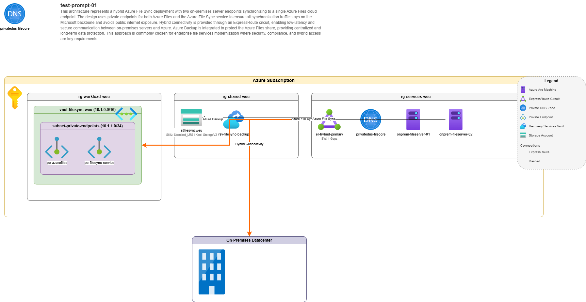

# Test Tracker

## Azure File Sync example - 01

Model Deployment: `gpt-5.2-chat (2025-12-11)`

Prompt:

```txt
I need you to create an architecture diagram for an Azure File Sync workload in where there are 2 server endpoints on premises and 1 cloud endpoint.
This architecture SHOULD show Azure Backup for the Azure Files, MUST leverage private endpoints for Azure File Sync service and Azure Files, MUST show hybrid connectivity with an ExpressRoute circuit or VPN tunnel.
```

Response:

```txt
This architecture represents a hybrid Azure File Sync deployment with two on-premises server endpoints synchronizing to a single Azure Files cloud endpoint. The design uses private endpoints for both Azure Files and the Azure File Sync service to ensure all synchronization traffic stays on the Microsoft backbone and avoids public internet exposure. Hybrid connectivity is provided through an ExpressRoute circuit, enabling low-latency and secure communication between on-premises servers and Azure. Azure Backup is integrated to protect the Azure Files share, providing centralized and long-term data protection. This approach is commonly chosen for enterprise file services modernization where security, compliance, and hybrid access are key requirements.
```

Output(s):


