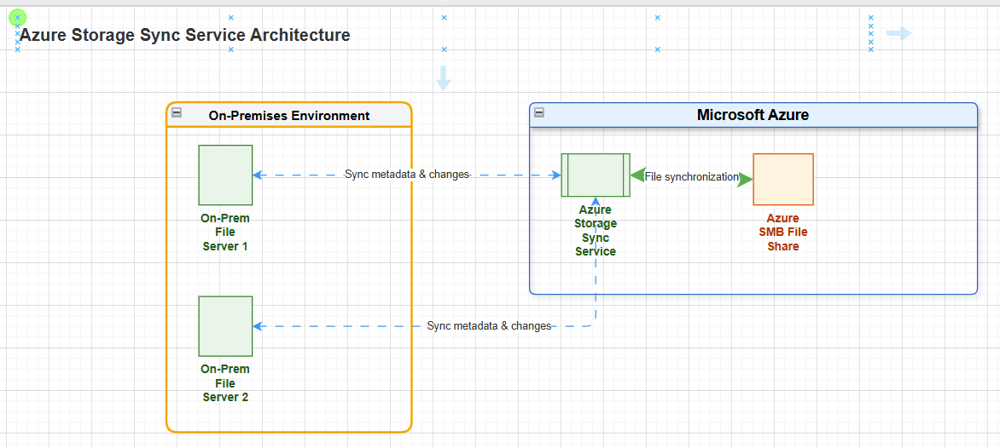
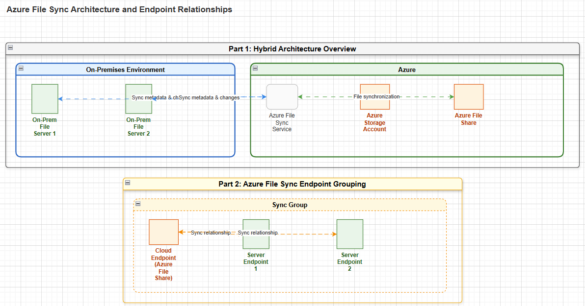
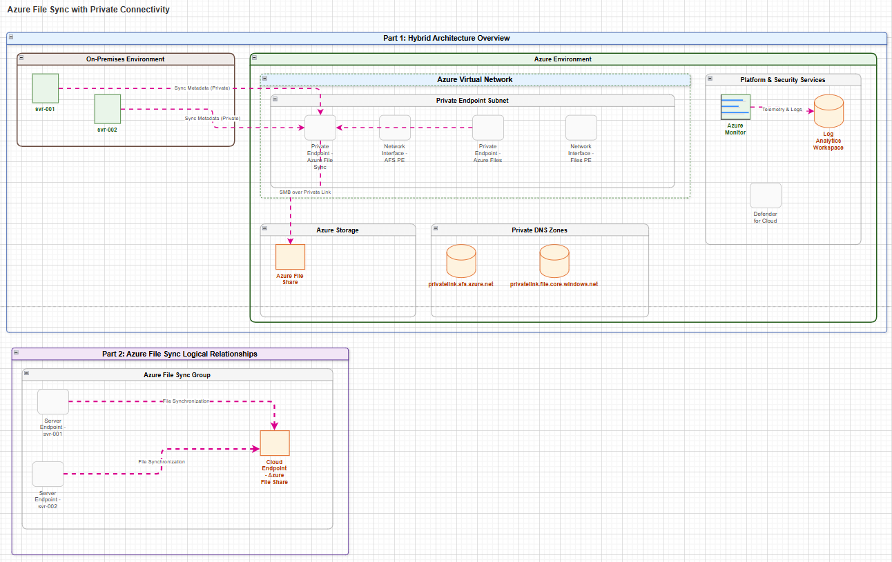
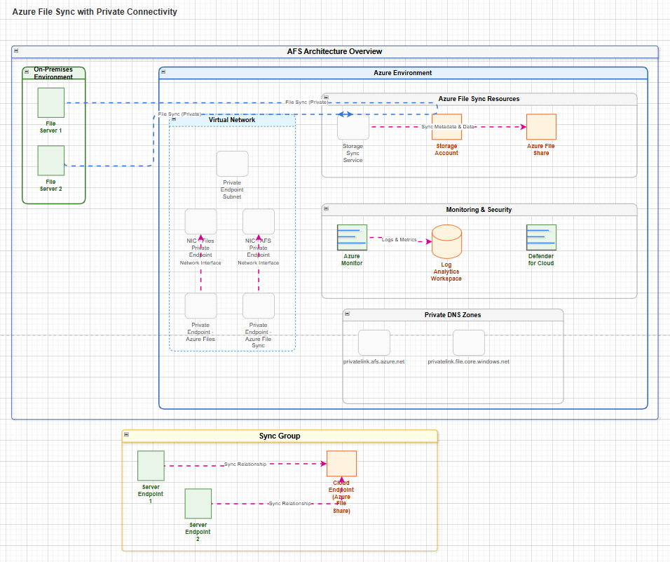
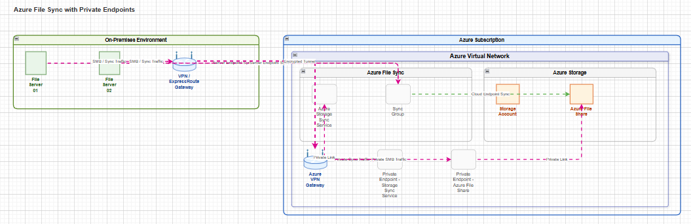
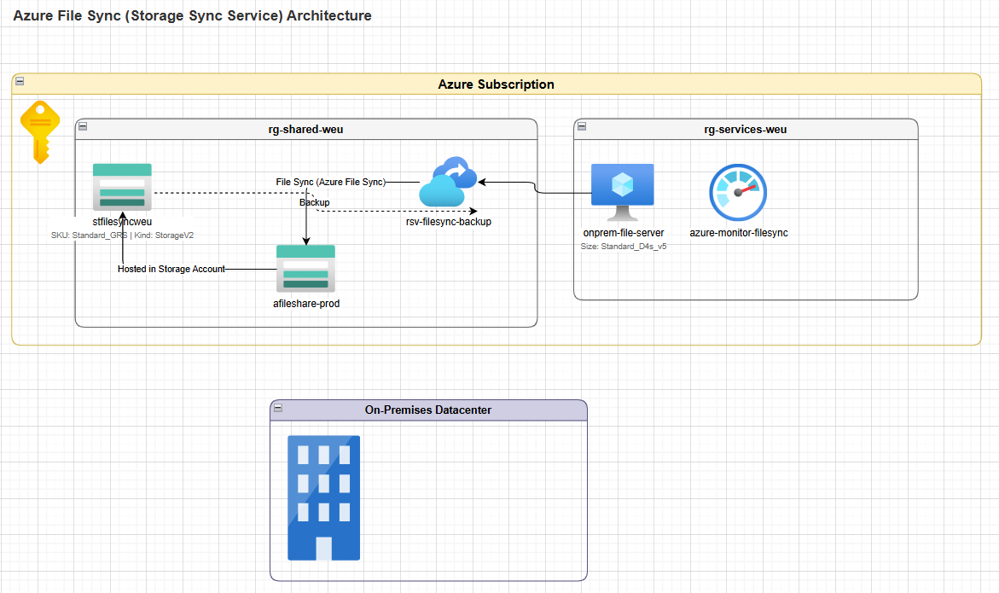
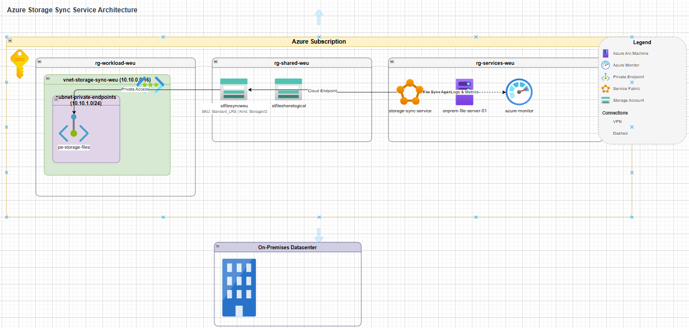
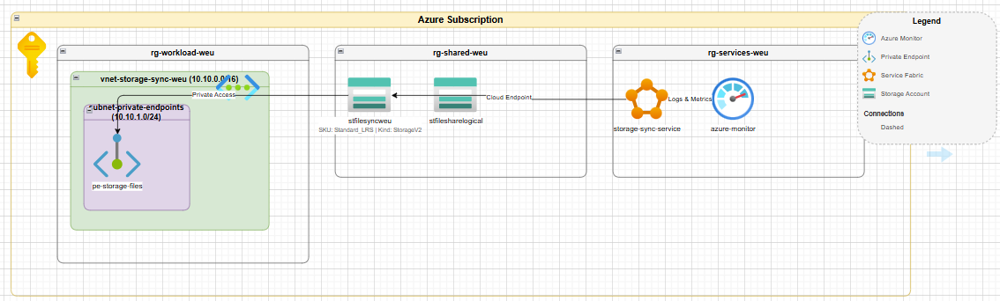
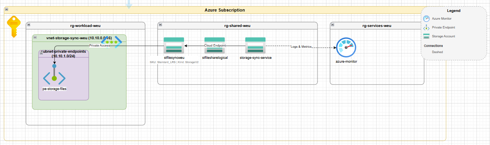
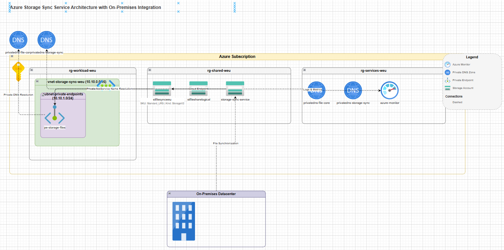

# Scenario: Azure File Sync (Azre Storage Sync Service)

## Overview

Using Mika's Architecture Generator tool in both modes to create an Azure File Sync workload.

## Generic

### Configuration

Model Deployment: `gpt-5.2-chat 2025-12-11`  
Diagram Mode: `Generic`

### Attempt #1

Prompt:

```
Create an architecture diagram that shows an Azure Storage Sync Service workload. It should show two on-premises servers as the server endpoints and an Azure SMB File share.
```

Output:



### Attempt #2

Prompt:

```
Create an Azure diagram that shows an Azure File Sync workload. It should show two on-premises servers. These two on-premises servers will serve as the server endpoints. In this singular diagram, you should create two parts. Part 1 will show the architecture structure as expected, across on-premises and Azure. Part 2 should be primarily focused on showing the grouping of the Server Endpoints and the Cloud Endpoint relationship.
```

Output:



### Attempt #3

Prompt:
```
Create an Azure diagram that shows an Azure File Sync workload. It should show two on-premises servers, named svr-001 and svr-002. These two on-premises servers will serve as the server endpoints and should be a part of the same Sync Group. 

For the Azure environment, there should be private connectivity configured, according to Microsoft best practice guidance. There should be what is needed for private connectivity, such as:
- a virtual network
- the required private endpoint subnet(s)
- the required privated endpoint(s)
- the required network interface(s)
- Private DNS Zone deployment(s) for privatelink.afs.azure.net and privatelink.file.core.windows.net

Please have a portion of the architecture diagram that indicates the existence of some of the other resources that will be active in the environment, such as: 
- Azure Monitor
- Defender for Cloud
- Azure Log Analytics

In this singular diagram, you should create two parts. Part 1 will show the architecture structure as expected, across on-premises and Azure. Part 2 should be primarily focused on showing the grouping of the Server Endpoints and the Cloud Endpoint relationship.
```

Output:



### Attempt #4

Prompt:

```
Create an Azure diagram that shows an Azure File Sync workload. 

For the On-premises environment, it should show two on-premises servers. These two on-premises servers will serve as the server endpoints and will be a part of the same Sync Group. If possible, the diagram should show with icons that each on-premises server has been Arc-enabled and has the File Sync Agent (v21.5) installed.

For the Azure environment, there should be private connectivity configured, according to Microsoft best practice guidance. There should be what is needed for private connectivity, such as:
- Private DNS Zone deployment for privatelink.afs.azure.net and privatelink.file.core.windows.net
- a virtual network
- the required private endpoint subnet(s)
- the required private endpoint(s)
- the required network interface(s)

Create a portion of the architecture diagram that indicates the existence of: 
- Azure Monitor
- Defender for Cloud
- Azure Log Analytics

In this singular diagram, you should create two parts. Part 1 (titled "AFS Architecture Overview") will show the architecture structure as expected, across on-premises and Azure. Part 2 (titled "Sync Group") should be primarily focused on showing the groupings and relationship of the Server Endpoints (on the left) and the Cloud Endpoint (on the right).
```

Output:



### Attempt #5

Prompt:

```
Create an Azure diagram for Azure File Sync. For the sync group, there should be two on-premises servers that are the server endpoints and one Azure File share that serves as the cloud endpoint. Create private endpoints for the Azure Storage Sync Service and Azure File share. Be sure to show the networking components to ensure the architectural components are clearly and accurately indicated.
```

Output:



### Analysis

TBD

## Azure

### Configuration

Model Deployment: Gpt-5.2-chat 2025-12-11  
Diagram Mode: Azure | Prompt

### Initial

Prompt:

```
Create an architecture diagram of an Azure Storage Sync Service workload.
```

Output:



Ran the same prompt again just to see what would happen…



### Refinement(s)

Refinement #1: Remove this onprem-file-server-01 resource

Output:




Refinement #2: The storage-sync-service needs to use the Azure Storage Sync Service icon.

Output:




Refinement #3: Add a section of the diagram indicating an On-premises environment. Change the storage-sync-service icon from a Storage Account to a Storage Sync Service (or Azure File Sync) icon. Add private dns zone for Azure Files and Azure Storage Sync Service.

Output:



### Analysis

TBD
